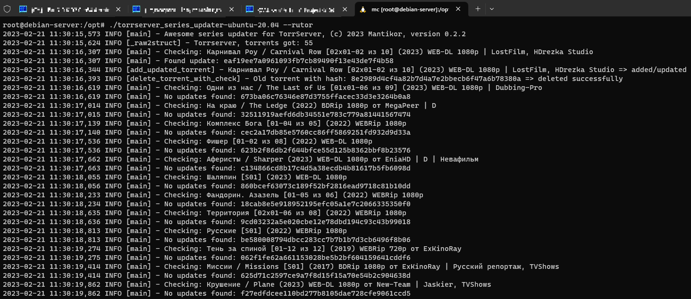

[](https://github.com/Mantikor/TorrserverSeriesUpdater/actions/workflows/docker-image-release.yml) [](https://github.com/Mantikor/TorrserverSeriesUpdater/actions/workflows/build-binaries.yml) []()

# Updater for torrents with new episodes of series on TorrServer, added from litr.cc (RSS-feed, supported all trackers) and added via TorrServer Adder: rutor.info(is), nnmclub.to, torrent.by.

# Программа для обновления торрентов с сериалами в TorrServer. Обновляет раздачи с сериалами, которые обновляются путем добавления новых серий. Поддерживаются litr.cc (через чтение RSS-ленты, поддерживаюися все трэкеры) и раздачи, добавленные через TorrServer Adder с трэкеров rutor.info(is), nnmclub.to, torrent.by.



## Russian/Русский

Доступны следующие режимы:

1. **_--rutor_**, обновление торрентов напрямую с rutor.info(is) (не нужны никакие регистрации и прочее), в этом режиме берется список торрентов из TorrServer, определяется, какие из них добавлены из трэкера rutor.info, если в раздаче появились новые серии, то торрент обновляется, с сохранением отметок о просмотренных сериях, старый торрент удаляется.
2. **_--nnmclub_**, обновление торрентов напрямую с nnmclub.to (не нужны никакие регистрации и прочее), в этом режиме берется список торрентов из TorrServer, определяется, какие из них добавлены из трэкера nnmclub.to, если в раздаче появились новые серии, то торрент обновляется, с сохранением отметок о просмотренных сериях, старый торрент удаляется.
3. **_--torrentby_**, обновление торрентов напрямую с torrent.by (не нужны никакие регистрации и прочее), в этом режиме берется список торрентов из TorrServer, определяется, какие из них добавлены из трэкера torrent.by, если в раздаче появились новые серии, то торрент обновляется, с сохранением отметок о просмотренных сериях, старый торрент удаляется.
4. **_--litrcc_**,  обновление торрентов из RSS-ленты litr.cc (нужна регистрация на сайте, после чего требуется взять UUID для RSS-ленты и указать в параметрах при запуске программы). Поддерживаются все трэкеры поддерживаемые litr.cc. Торрент из RSS-ленты будет либо обновлен, либо автоматически добавлен в TorrServer, если его там нет. Если торрент с таким же хэшем был добавлен через TorrServer Adder или вручную, то он будет перезаписан, и в дальнейшем обновления будут браться из RSS-ленты litr.cc.
5. **_--cleanup_**, режим для поиска и удаления старых торрентов с количеством серий, меньшим чем текущее, ищет все раздачи с одинаковым id, оставляет раздачу с наибольшим количеством серий, а остальные удаляет (пока поддерживаются только раздачи с rutor, которые добавлены либо через TorrServer Adder либо через RSS-ленту litr.cc).
6. комбо-режим: можно указать сочетание из любых вышеперечисленных ключей (каждый из режимов может перезаписать торрент под себя и в последующем обновление будет происходить через данный режим, поэтому старайтесь избегать без лишней необходимости комбо-режим).


Программа распространяется как есть, баги и предложения по улучшению просьба добавлять в issues или писать на почту.

Процесс использования выглядит так: вы добавляете торрент с rutor.info(is)/nnmclub.to/torrent.by в TorrServer через TorrServer Adder или добавляете торрент для мониторинга в litr.cc после чего периодически запускаете программу и она обновляет торренты если вышли новые серии сериала, сохраняя при этом отметки просмотренных серий. 
## Установка

### Готовые бинарные файлы

Начиная с версии 0.2.2 можно скачать готовые исполняемые файлы для Linux/MacOS/Windows в разделе с релизами. Протестировано: Windows 11 Pro x64, Windows 10 Pro x64, Ubuntu 20.04, Ubuntu 22.04, Debian server 11, MacOS. Аргументы для запуска те же, что и для скрипта: `--cleanup/--rutor/--litrcc/--nnmclub/--torrentby --ts_url TORRSERVER_URL --ts_port TORRSERVER_PORT`.

### Для пользователей Windows

Скачиваем [Python](https://www.python.org/ftp/python/3.11.2/python-3.11.2.exe) и устанавливаем его, не забываем отметить при установке галку на **добавить путь в переменную PATH**. Далее [скачиваем последний релиз](https://github.com/Mantikor/TorrserverSeriesUpdater/releases), файл **SourceCode.zip** и распаковываем в удобную папку. Заходим в распакованную папку и по клику правой кнопкой запускаем терминал. В терминале набираем `pip3 install requirements.txt`, установятся нужные для работы пакеты. Далее запускаем скрипт: `python series_updater.py --litrcc RSS_FEED_UUID --ts_url TORRSERVER_URL --ts_port TORRSERVER_PORT` для обновления из RSS-ленты litr.cc или `python series_updater.py --rutor --ts_url TORRSERVER_URL --ts_port TORRSERVER_PORT` для обновления с rutor. **TORRSERVER_URL** - адрес компьютера, где запущен TorrServer (например http://127.0.0.1, если на том же компьютере, откуда запускаете скрипт), **TORRSERVER_PORT** - порт, можно не указывать, если у вас порт по умолчанию **8090**.

Если на компьютере установлен Docker Desktop, то можно скачать уже готовый образ `mantik0r/torrserver_series_updater:latest` и запускать: `docker run --rm torrserver_series_updater:latest python series_updater.py --rutor --ts_url TORRSERVER_URL --ts_port TORRSERVER_PORT`

### Для пользователей Linux

Запуск через скрипт работает так же как и для Windows: Python уже обычно есть в дистрибутиве, скрипт устанавливается так же как и для Windows.

Для Docker, скачиваем образ: `sudo docker pull mantik0r/torrserver_series_updater:latest` а потом запускаем: `sudo docker run --rm torrserver_series_updater:latest python series_updater.py --rutor --ts_url TORRSERVER_URL --ts_port TORRSERVER_PORT`

## English/Английский

The following modes are available:

1. **_--rutor_**, rutor direct torrents update (no registration needed), in this mode we get torrents list from TorrServer, check torrents added from rutor, after we search torrents on site and if new series allowed we update our torrent and preserve viewed episodes marks, old torrent will be deleted.
2. **_--nnmclub_**, nnmclub.to direct torrents update (no registration needed), in this mode we get torrents list from TorrServer, check torrents added from nnmclub.to, after we search torrents on site and if new series allowed we update our torrent and preserve viewed episodes marks, old torrent will be deleted.
3. **_--torrentby_**, torrent.by direct torrents update (no registration needed), in this mode we get torrents list from TorrServer, check torrents added from Torrent.by, after we search torrents on site and if new series allowed we update our torrent and preserve viewed episodes marks, old torrent will be deleted.
4. **_--litrcc_**, torrents update from RSS-feed of litr.cc (you need registration on site, and you need RSS-feed UUID, you need to pass UUID to running parameters), supported all trackers supported by litr.cc, torrent will be updated or will be added to TorrServer. Torrents with same hash added by other modes may be overwritten and will be update with litrcc mode in the future.
5. **_--cleanup_**, mode for search and deletion old torrents, with fewer episodes than current. Will be search all torrents with the same id, leaves torrent with the most series, and deletes other (supported torrents from rutor, added with TorrServer Adder or RSS-feed litr.cc).
6. combo-mode: use combination of all supported keys (each of the modes can rewrite the torrent for itself and in the future the update will occur through this mode, so try to avoid the combo mode without unnecessary need).

The program is distributed as is, bugs and suggestions for improvement you can add to issues or write to the e-mail.

## Installation

### Precompiled binary files

From version 0.2.2 you can download precompiled binary (executable) files for Linux/MacOS/Windows in release section. Tested on: Windows 11 Pro x64, Windows 10 Pro x64, Ubuntu 20.04, Ubuntu 22.04, Debian server 11, MacOS. Run arguments are the same for binary and for script: `--cleanup/--rutor/--litrcc/--nnmclub/--torrentby --ts_url TORRSERVER_URL --ts_port TORRSERVER_PORT`.


### Docker container

You need [Docker](https://docs.docker.com/engine/install/) preinstalled
```
sudo docker pull mantik0r/torrserver_series_updater:latest
```

### Python script

You need [Python 3.11](https://www.python.org/downloads/) or higher preinstalled

download archive with release or clone git repo

install requirements
```
pip3 install requirements.txt
```
run script
```
python series_updater.py --litrcc RSS_FEED_UUID --ts_url TORRSERVER_URL --ts_port TORRSERVER_PORT
```
or
```
python series_updater.py --rutor --ts_url TORRSERVER_URL --ts_port TORRSERVER_PORT
```

## Running

### Docker container

#### Run update from litr.cc
```
sudo docker run --rm torrserver_series_updater:latest python series_updater.py --litrcc RSS_FEED_UUID --ts_url TORRSERVER_URL --ts_port TORRSERVER_PORT
```

#### Run update from rutor.info
```
sudo docker run --rm torrserver_series_updater:latest python series_updater.py --rutor --ts_url TORRSERVER_URL --ts_port TORRSERVER_PORT
```

#### Run update from nnmclub.to
```
sudo docker run --rm torrserver_series_updater:latest python series_updater.py --nnmclub --ts_url TORRSERVER_URL --ts_port TORRSERVER_PORT
```

#### Run cleanup mode
```
sudo docker run --rm torrserver_series_updater:latest python series_updater.py --cleanup --ts_url TORRSERVER_URL --ts_port TORRSERVER_PORT
```

**RSS_FEED_UUID**, like as 21100112-ffff-aaaa-cccc-e00110011fff - litr.cc RSS-feed identifier

**TORRSERVER_URL**, like as http://192.168.1.2 - ip address of TorrServer instance (default: **http://127.0.0.1**)

**TORRSERVER_PORT**, like as 8090 - port of TorrServer instance (default: **8090**)

### Python script

#### Run update from Litr.cc without settings file

`series_updater.py --litrcc 21100112-ffff-aaaa-cccc-e00110011fff --ts_url http://192.168.1.2`

#### Run update from Rutor without settings file

`series_updater.py --rutor --ts_url http://192.168.1.2`

#### Run cleanup mode

`series_updater.py --cleanup --ts_url http://192.168.1.2`

### log sample
```
2023-02-12 23:58:43,466 INFO [load_config] - Settings loaded from file: config.yaml
2023-02-12 23:58:43,536 INFO [_raw2struct] - Torrserver, torrents got: 53
2023-02-12 23:58:43,773 INFO [_raw2struct] - Litr.cc mode: torrents got: 5
2023-02-12 23:58:43,773 INFO [main] - Litr.cc mode: RSS uuid: 20000000-ffff-ffff-ffff-200000000000
2023-02-12 23:58:44,041 INFO [main] - Территория [02х01-05 из 08] (2022) WEBRip 1080p => added/updated
2023-02-12 23:58:44,229 INFO [main] - 1 episode => set as viewed
2023-02-12 23:58:44,251 INFO [main] - 2 episode => set as viewed
2023-02-12 23:58:44,275 INFO [main] - 3 episode => set as viewed
2023-02-12 23:58:44,317 INFO [main] - Old torrent with hash: f3215ad290fa443a57ae22fabd42debb22342d56 => deleted successfully
2023-02-12 23:58:44,354 INFO [main] - Old torrent with hash: 7d9abeda29e8a96567716283292193c26c304328 => deleted successfully
2023-02-12 23:58:44,369 INFO [main] - Old torrent with hash: e06823f26091d9cc988d0558e6f6a82c9e505322 => deleted successfully
```

[TorrServer](https://github.com/YouROK/TorrServer)

[TorrServer Adder for Chrome](https://chrome.google.com/webstore/detail/torrserver-adder/ihphookhabmjbgccflngglmidjloeefg)

[TorrServer Adder for Firefox](https://addons.mozilla.org/ru/firefox/addon/torrserver-adder/)

[TorrServe client on 4PDA](https://4pda.to/forum/index.php?showtopic=889960)